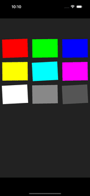

# react-native-drag-sort-gridview



## Getting started

Animation is accelerated by react-native-reanimated and react-addons-update. Please install and setup [react-native-reanimated](https://github.com/kmagiera/react-native-reanimated)

```
npm install react-native-drag-sort-gridview --save
npm install react-addons-update --save
```

or

```
yarn add react-native-drag-sort-gridview react-addons-update
```

## Usage

```ts
import React, { useState } from 'react'
import { View } from 'react-native'
import DraggableGridView from 'react-native-drag-sort-gridview'

interface IItem {
  id: number
  color: string
}

const Example = () => {
  const [data, setData] = useState<Array<IItem>>([
    { id: 0, color: '#FF0000' },
    { id: 1, color: '#00FF00' },
    { id: 2, color: '#0000FF' },
    { id: 3, color: '#FFFF00' },
    { id: 4, color: '#00FFFF' },
    { id: 5, color: '#FF00FF' },
    { id: 6, color: '#FFFFFF' },
    { id: 7, color: '#888888' },
    { id: 8, color: '#555555' }
  ])

  return (
    <DraggableGridView
      style={{
        overflow: 'visible',
        backgroundColor: '#222222',
        paddingVertical: 80
      }}
      contentContainerStyle={{
        justifyContent: 'flex-start'
      }}
      itemContainerStyle={{
        padding: 10
      }}
      isEditing={true}
      numColumns={3}
      itemHeight={100}
      data={data}
      keyExtractor={({ id }) => `${id}`}
      onOrderChanged={orderedData => {
        setData(orderedData)
      }}
      renderItem={({ item }) => {
        return <View style={{ width: '100%', height: 80, backgroundColor: item.color }}></View>
      }}
    />
  )
}

export default Example
```

## Props

Accept all props in [FlatList](https://facebook.github.io/react-native/docs/flatlist)

| Name               | Type      | Required | Description                                                                                                                                                                                                                                                                        |
| ------------------ | --------- | -------- | ---------------------------------------------------------------------------------------------------------------------------------------------------------------------------------------------------------------------------------------------------------------------------------- |
| data               | Array<T>  | ✓        | Same as [FlatList data](https://reactnative.dev/docs/flatlist#required-data).                                                                                                                                                                                                      |
| renderItem         | function  | ✓        | Simular to [FlatList renderItem](https://reactnative.dev/docs/flatlist#required-renderitem) but this module does NOT accept JSX.Element.                                                                                                                                           |
| isEditing          | boolean   | ✓        | If `isEditing` is `true`, item can be sorted by drag & drop, but `onPress`/`onLongPress` within items would be blocked.                                                                                                                                                            |
| onOrderChanged     | function  | ✓        | Callback when touch end. `(orderedData: Array<T>, from: number, to: number)` would be returned. `orderedData` is an array of data with new order. `from` is the original position of the dragged item. `to` is the new position of the dragged item.                               |
| keyExtractor       | function  |          | Same as [FlatList keyExtractor](https://reactnative.dev/docs/flatlist#keyextractor).                                                                                                                                                                                               |
| numColumns         | number    |          | Default `1`. Same as [FlatList numColumns](https://reactnative.dev/docs/flatlist#numcolumns). If only 1 item is rendered in each row, you may use [react-native-draggable-flatlist](https://github.com/computerjazz/react-native-draggable-flatlist) which has better performance. |
| listWidth          | number    |          | Default `100% of screen width`. Width of the whole list, This value would be used to calcuate the width of item by `listWidth / numColumns`.                                                                                                                                       |
| itemHeight         | number    |          | Default `listWidth / numColumns`. Height of items.                                                                                                                                                                                                                                 |
| animMoveDuration   | number    |          | Default `1000`. The time taken (miliseconds) for non-dragged items to animate.                                                                                                                                                                                                     |
| debounce           | number    |          | Default `undefined`. Debounce (miliseconds) of non-dragged items to start animation. If value is undefined, there would be no debounce. Implementing debounce can improve performance. If debounce is needed, value `300` is recommanded.                                                                                                          |
| shouldVibrate      | boolean   |          | Default `true`. This determine should the items vibrate while editing.                                                                                                                                                                                                             |
| itemContainerStyle | ViewStyle |          | Style of item wrapper.                                                                                                                                                                                                                                                             |
