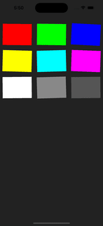

# react-native-drag-sort-gridview


## Example

[Examples](./example)

## Getting started

- react-native-animated 3: >= 1.4.1

- react-native-animated 2: <= 1.4.1

Animation is accelerated by react-native-reanimated and react-addons-update. Please install and setup [react-native-reanimated](https://github.com/kmagiera/react-native-reanimated).

```
npm install react-native-drag-sort-gridview --save
npm install react-addons-update --save
```

or

```
yarn add react-native-drag-sort-gridview react-addons-update
```

## Simple Usage

```ts
import React, { memo, useCallback, useState } from 'react'
import { StyleSheet, View } from 'react-native'
import DraggableGridView from 'react-native-drag-sort-gridview'

interface IItem {
  id: number
  color: string
}

const Item = memo(({ item }: { item: IItem }) => (
  <View style={[styles.item, { backgroundColor: item.color }]} />
))

const Example = () => {
  const [data, setData] = useState<Array<IItem>>([
    { id: 0, color: '#FF0000' },
    { id: 1, color: '#00FF00' },
    { id: 2, color: '#0000FF' },
    { id: 3, color: '#FFFF00' },
    { id: 4, color: '#00FFFF' },
    { id: 5, color: '#FF00FF' },
    { id: 6, color: '#FFFFFF' },
    { id: 7, color: '#888888' },
    { id: 8, color: '#555555' }
  ])

  const onOrderChanged = useCallback((orderedData: Array<IItem>) => setData(orderedData), [])

  const renderItem = ({ item }: { item: IItem }) => <Item item={item} />

  const keyExtractor = ({ id }: IItem) => `gridview-${id}`

  return (
    <DraggableGridView
      style={styles.bg}
      contentContainerStyle={styles.contentContainer}
      itemContainerStyle={styles.itemContainer}
      isEditing={true}
      numColumns={3}
      itemHeight={100}
      data={data}
      shouldAnimOnRelease={true}
      keyExtractor={keyExtractor}
      onOrderChanged={onOrderChanged}
      renderItem={renderItem}
    />
  )
}

const styles = StyleSheet.create({
  bg: {
    overflow: 'visible',
    backgroundColor: '#222222',
    paddingVertical: 80
  },
  contentContainer: {
    justifyContent: 'flex-start'
  },
  itemContainer: {
    padding: 10
  },
  item: {
    width: '100%',
    height: 80
  }
})

export default Example
```

Version >= 1.3.0 & `shouldAnimOnRelease={true}`\
\
`shouldAnimOnRelease={false}`\


## Props

Accept all props in [ScrollView](https://reactnative.dev/docs/scrollview)

| Name                 | Type      | Required | Description                                                                                                                                                                                                                                                                                                                                                                                                                      |
| -------------------- | --------- | -------- | -------------------------------------------------------------------------------------------------------------------------------------------------------------------------------------------------------------------------------------------------------------------------------------------------------------------------------------------------------------------------------------------------------------------------------- |
| data                 | Array<T>  | ✓        | Same as [FlatList data](https://reactnative.dev/docs/flatlist#required-data).                                                                                                                                                                                                                                                                                                                                                    |
| renderItem           | function  | ✓        | `(info: { item: T, index: number}) => React.ReactElement`. Simular to [FlatList renderItem](https://reactnative.dev/docs/flatlist#required-renderitem) but this module does NOT accept JSX.Element. Currently not accept separator. Highly recommond to [memo](https://beta.reactjs.org/reference/react/memo) the render items to improve performance.                                                                           |
| isEditing            | boolean   | ✓        | If `isEditing` is `true`, item can be sorted by drag & drop, but `onPress`/`onLongPress` within items would be blocked.                                                                                                                                                                                                                                                                                                          |
| onOrderChanged       | function  | ✓        | Callback when touch end. `(orderedData: Array<T>, from: number, to: number)` would be returned. `orderedData` is an array of data with new order. `from` is the original position of the dragged item. `to` is the new position of the dragged item.                                                                                                                                                                             |
| keyExtractor         | function  | ✓        | Same as [FlatList keyExtractor](https://reactnative.dev/docs/flatlist#keyextractor).                                                                                                                                                                                                                                                                                                                                             |
| isEditing            | boolean   | ✓        | If `isEditing` is `true`, item can be sorted by drag & drop, but `onPress`/`onLongPress` within items would be blocked.                                                                                                                                                                                                                                                                                                          |
| numColumns           | number    |          | Default `1`. Same as [FlatList numColumns](https://reactnative.dev/docs/flatlist#numcolumns). If only 1 item is rendered in each row, you may use [react-native-draggable-flatlist](https://github.com/computerjazz/react-native-draggable-flatlist) which has better performance.                                                                                                                                               |
| renderOnEditOverlay  | function  |          | `({ index }: { index: number}) => React.ReactElement`. Render overlay on top of renderItem while editing. Delete button can be added here. You may refer to [Example Usage](./example/src/routes/UsageScene). **This overlay will block the drag drop panResponder, therefore please keep it small in size.** Highly recommond to [memo](https://beta.reactjs.org/reference/react/memo) the render items to improve performance. |
| listWidth            | number    |          | Default `100% of screen width`. Width of the whole list, This value would be used to calcuate the width of item by `listWidth / numColumns`.                                                                                                                                                                                                                                                                                     |
| itemHeight           | number    |          | Default `listWidth / numColumns`. Height of items.                                                                                                                                                                                                                                                                                                                                                                               |
| animMoveDuration     | number    |          | Default `500`. The time taken (miliseconds) for non-dragged items to animate.                                                                                                                                                                                                                                                                                                                                                    |
| debounce             | number    |          | Default `undefined`. Debounce (miliseconds) of non-dragged items to start animation. If value is undefined, there would be no debounce. Implementing debounce can improve performance. If debounce is needed, value `300` is recommanded.                                                                                                                                                                                        |
| shouldVibrate        | boolean   |          | Default `true`. This determine should the items vibrate while editing.                                                                                                                                                                                                                                                                                                                                                           |
| shouldAnimOnRelease  | boolean   |          | Default `false`. This determine should the dragging item be animated after user released press. **Touch would be blocked until all animations end**.                                                                                                                                                                                                                                                                             |
| onMovingStateChanged | function  |          | This callback would be called only when `shouldAnimOnRelease` is `true`. `(isMoving: boolean)` would be returned. Since the touch of list would be blocked until all animations end, this can be used to indicate whether touch is blocked or not.                                                                                                                                                                               |
| scrollThreshold      | number    |          | Default `undefined`. If this value > 0, the actual threshold of scrolling would be `height_of_list * scrollThreshold`. If user is dragging and moving to a position `< threshold` or `> height_of_list - threshold`, the list will scroll upward and downward correspondingly. Value `0.2` is recommanded. You may refer to [Example Defined Size](./example/src/routes/DefinedSizeScene).                                       |
| itemContainerStyle   | ViewStyle |          | Style of item wrapper. User may scroll the list on space created by padding during editing. E.g. `itemContainerStyle={{ padding: 10 }}` in usage example.                                                                                                                                                                                                                                                                        |
