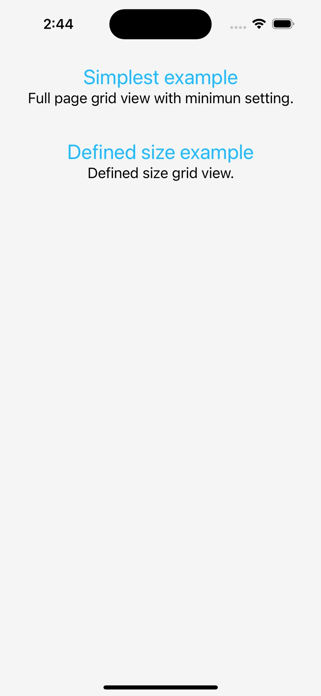
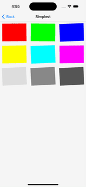
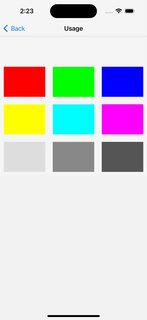
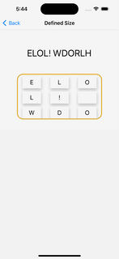
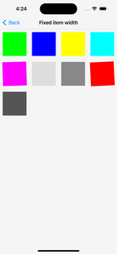
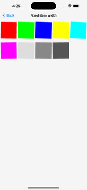
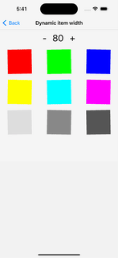

# react-native-drag-sort-gridview Example

## Home page

### press to view example



## Simplest implemetation

### Full page grid view with minimun setting.

[./example/src/routes/SimplestScene](./src/routes/SimplestScene)\


## Usage example

### Press to select item when isEditing is false. Long press item to enable editing.

[./example/src/routes/UsageScene](./src/routes/UsageScene)\


## Defined list size example

### Defined size of list.

[./example/src/routes/DefinedSizeScene](./src/routes/DefinedSizeScene)\


## Fixed item width example

### Gird view with fixed item width(80) on difference devices.

[./example/src/routes/FixedItemWidthScene](./src/routes/FixedItemWidthScene)\



## Dynamic item width example

### Gird view with dynamic item width(init 100).

[./example/src/routes/DynamicItemWidthScene](./src/routes/DynamicItemWidthScene)\


## Getting started

```
yarn install
cd ios
pod install
cd ..
yarn start
```
